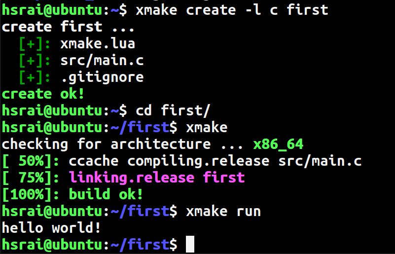

[Index](../Lab.md) | [Previous](Connect_to_remote_server.md)

# Compiling and running 1st Computer Program

In this session, you are going to compile and execute (run) a simple C
computer program. We will provide you code, so you need not to type the
code. All necessary instructions are provided here, to obtain the code,
compile it and then run the code.

When you login a remote server, after some message, you will be prompted to
enter your command through key-board.

"Solid Rectangle" is the position, where your typed character will appear.

Before that "Solid Rectangle", called cursor, server provide you handy
information, which contain your UserID and ServerName.

It may be:

	19123015@computer-centre:~$ 

or

	hsrai@Code:~$

where before `@` is your UserID and after `@` is the name of Server where
you logged-in.

On connecting to remote server, if you get message:

	Mosh: You have a detached Mosh session on this server (mosh [1234]).

then you need issue following command:

	kill 1234

Where 1234 in [ ] may be a different number than 1234, as shown above.    

On computers, information is stored in files and files are stored in folder
(also called directory). A folder may contain files and / or folders.

You may order (or request, if you are a civilised) to present you a list
(shortened as `ls`) of files and directories in the current folder.  To
do so, we issue following command (you need to type only `ls` and then hit
`Enter`).

	hsrai@CC:~$ ls
	public_html

You are in a relative very thinly populated area.  There is just one
directory (folder) with name public_html.  You may create folder in the
current folder or in folder `public_html`, to manage your files, which you
will create yourself or download from the Internet.

To move from current directory to `public_html`, issue following command
(order or request) to the computer:

	hsrai@CC:~$ cd public_html

Because you want to change directory, so you need to issue short-cut of
"Change Directory" as `cd` (we know that you love short-cuts).  After `cd`
you need give name of the directory, where you wish to move.

In `public_html`, issue following commands:

	hsrai@CC:~/public_html$ mkdir Code
	hsrai@CC:~/public_html$ ls
	hsrai@CC:~/public_html$ cd Code

The text you see, something like `hsrai@CC:~public_html/Code/$` is called
Prompt String (`PS`).

	radha@ubuntu:~$ xmake create -l c first
	create first ...
	  [+]: xmake.lua
	  [+]: src/main.c
	  [+]: .gitignore
	create ok!
	radha@ubuntu:~$ cd first/
	radha@ubuntu:~/first$ xmake
	checking for architecture ... x86_64
	[ 50%]: ccache compiling.release src/main.c
	[ 75%]: linking.release first
	[100%]: build ok!
	radha@ubuntu:~/first$ xmake run
	hello world!

With this you are able to compile and run (execute) your 1st computer
program.

You may wish to play with this, by changing the message. Use editor of your
choice. It may be vim, nano (pico), joe, Emacs or any other as per your
liking. We use `nano` in the following example. Change message, exit editor
(by pressing [ctrl]+x which mean you need to press x key from key-borad,
while pressing and holding [ctrl] key down) and save file (answering yes, by
pressing y to message:

	Save modified buffer?  (Answering "No" will DISCARD changes.)

), while exiting. 

	nano src/main.c
	
After this, you need to compile it and run again to see the change in
action. Do as follow:

	$ xmake
	$ xmake run

The first command is to compile and second is to execute the code.

Good going till now. Take break, re-read above, if required. Change message
again, compile and execute the code.

Have fun!

[Index](../Lab.md) | [Next](Compiling_and_running_program_by_amending_messages.md)
